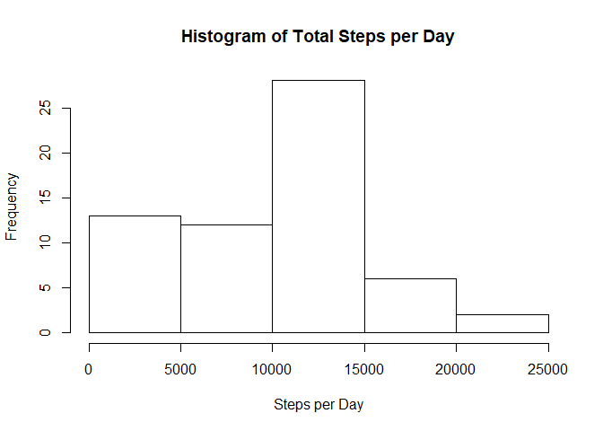
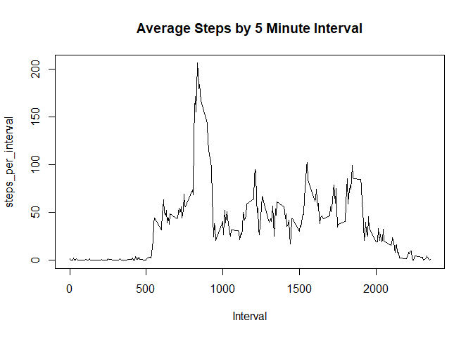
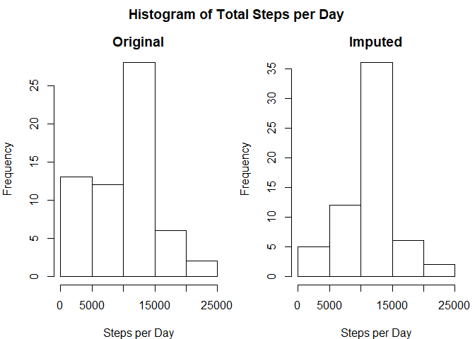
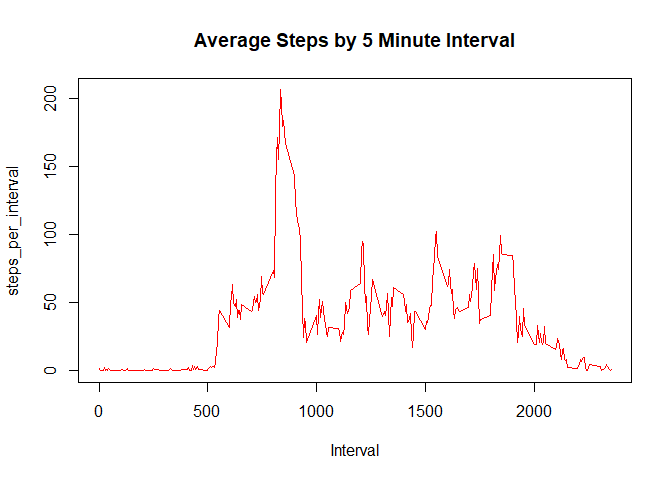

## Loading and preprocessing the data

### 1. Load the data

The data is already included in the repository, the following commands are used to load the data.


```r
unzip("activity.zip")
step_data <- read.csv("activity.csv", stringsAsFactors = FALSE)
str(step_data)
```

```
## 'data.frame':	17568 obs. of  3 variables:
##  $ steps   : int  NA NA NA NA NA NA NA NA NA NA ...
##  $ date    : chr  "2012-10-01" "2012-10-01" "2012-10-01" "2012-10-01" ...
##  $ interval: int  0 5 10 15 20 25 30 35 40 45 ...
```

The variables included in this dataset are:

- **steps**: Number of steps taking in a 5-minute interval (missing values are coded as NA)
- **date**: The date on which the measurement was taken in YYYY-MM-DD format
- **interval**: Identifier for the 5-minute interval in which measurement was taken

### 2. Process/transform the data

We need to process the data into a format suitable for our analysis.
Since the date is a string, it is necessary to convert it to a Date class so further processing can be done on it.


```r
step_data$date <- as.Date(step_data$date, "%Y-%m-%d")
```

The following R code is used to explore the data just a little. It provides the reader with a sense of the data.


```r
summary(step_data$steps)
```

```
##    Min. 1st Qu.  Median    Mean 3rd Qu.    Max.    NA's 
##    0.00    0.00    0.00   37.38   12.00  806.00    2304
```

```r
range(step_data$date)
```

```
## [1] "2012-10-01" "2012-11-30"
```

```r
range(step_data$interval)
```

```
## [1]    0 2355
```

## What is mean total number of steps taken per day?

This part of the assignment ignores the missing values (**NA**s) in the dataset.

### 1. Calculation of the total number of steps taken per day

Note: this is just a little easier using the `with` function since it eliminates having to use the `step_data$` in front of each variable name.


```r
steps_per_day <- with(step_data, tapply(steps, date, sum, na.rm = TRUE))
summary(steps_per_day)
```

```
##    Min. 1st Qu.  Median    Mean 3rd Qu.    Max. 
##       0    6778   10395    9354   12811   21194
```

### 2. Histogram of the total number of steps taken each day

- **histogram**: represents the frequency distribution of continuous variables
- **barplot** (or bar chart): is a diagrammatic comparison of discrete variables

_from https://keydifferences.com/difference-between-histogram-and-bar-graph.html _


```r
hist(steps_per_day,
     xlab = "Steps per Day",
     main = "Histogram of Total Steps per Day"
)
```

<!-- -->

### 3. Mean and median of the total number of steps taken per day


```r
mean_steps_per_day <- mean(steps_per_day)
median_steps_per_day <- median(steps_per_day)
```

The mean (average) number of steps per day is 9354 
and the median is 10395 steps.

## What is the average daily activity pattern?

### 1. Time series plot of **steps** vs. **interval** 
This is a time series plot of the 5-minute interval and the average number of steps taken, averaged across all days.

First we need to calculate the mean of the steps across all the days in the dataset.


```r
steps_per_interval <- with(step_data, tapply(steps, interval, mean, na.rm = TRUE))
str(steps_per_interval)
```

```
##  num [1:288(1d)] 1.717 0.3396 0.1321 0.1509 0.0755 ...
##  - attr(*, "dimnames")=List of 1
##   ..$ : chr [1:288] "0" "5" "10" "15" ...
```

Then we can plot the result:


```r
plot(x = names(steps_per_interval),
     y = steps_per_interval,
     xlab = "Interval",
     main = "Average Steps by 5 Minute Interval",
     type = "l"
)
```

<!-- -->

### 2. Maximum number of steps

Although we can get a fairly close idea from the plot above, let's find the exact 5-minute interval, on average across all the days in the dataset, 
that contains the maximum number of steps?


```r
max_interval <- names(steps_per_interval)[which.max(steps_per_interval)]
```

So the 5-minute interval with the maximum average steps is 835. 

## Imputing missing values

Note that there are a number of days/intervals where there are missing values (coded as **NA**). The presence of missing days may introduce bias into some calculations or summaries of the data.

### 1. Total number missing values

Calculate and report the total number of missing values in the dataset (i.e. the total number of rows with **NA**s). In looking at the data at the beginning of this study, we see that all of the **NA**s are in the `steps` variable.


```r
na_values = sum(is.na(step_data$steps))
na_percent = 100 * na_values / nrow(step_data)
```

So we see that there are 2304 **NA**s in the dataset, which represents 13.1147541% of the total `steps` values.

### 2. A strategy for filling missing values

We need to devise a strategy for filling in all of the missing values in the dataset. The strategy does not need to be sophisticated. For example, we could use the mean/median for that day, or the mean for that 5-minute interval, etc.

Exploring the data a little we see if we look at the data by intervals, we see that there are 8 values, i.e. 8 days, missing for each interval. 


```r
all(table(step_data$interval) == 61)
```

```
## [1] TRUE
```

```r
all(table(step_data$interval[is.na(step_data$steps)]) == 8)
```

```
## [1] TRUE
```

Furthermore, we see that when we look at data by days, that each day has either all the steps data, or none. In-other-words, we are missing all the data for the 8 days seen below.


```r
all(table(step_data$date) == 288)
```

```
## [1] TRUE
```

```r
table(step_data$date[is.na(step_data$steps)])
```

```
## 
## 2012-10-01 2012-10-08 2012-11-01 2012-11-04 2012-11-09 2012-11-10 
##        288        288        288        288        288        288 
## 2012-11-14 2012-11-30 
##        288        288
```

### 3. Create a new dataset with the missing data filled in

So, let's create a new dataset that is equal to the original dataset but with the missing data filled in. We will use the mean data by interval to replace the **NA**s.


```r
step_data_imputed <- step_data
bad <- is.na(step_data$steps)
interval_index <- match(step_data$interval[bad],names(steps_per_interval))
step_data_imputed$steps[bad] <- steps_per_interval[interval_index]
```

### 4. Comparison with the original data

#### Total steps by day

Here is a comparison between the histograms of the original data and the imputed data. We see a significant drop of the lowest bar, since the sum of the **NA**'s 
(when using `rm.na = TRUE`) is zero if all the values are **NA**. The middle bar is higher since this is the bar that contains the total of the means by interval 
(10766).


```r
steps_per_day_imputed <- with(step_data_imputed, tapply(steps, date, sum, na.rm = TRUE))
par(mfrow = c(1,2), mar = c(4,4,2,1), oma = c(0,0,2,0))
hist(steps_per_day,
     xlab = "Steps per Day",
     main = "Original"
)
hist(steps_per_day_imputed,
     xlab = "Steps per Day",
     main = "Imputed"
)
title("Histogram of Total Steps per Day", outer = TRUE)
```

<!-- -->

Calculate and report the mean and median total number of steps taken per day. Do these values differ from the estimates from the first part of the assignment? What is the impact of imputing missing data on the estimates of the total daily number of steps?


```r
mean1 <- mean(steps_per_day)
mean2 <- mean(steps_per_day_imputed)
median1 <- median(steps_per_day)
median2 <- median(steps_per_day_imputed)
```


|        | original    | imputed     |
| ------ | ----------- | ----------- |
| mean   | 9354   | 10766   |
| median | 10395 | 10766 |


#### Mean steps by interval

Not surprisingly, the plot of means steps by interval is unchanged, as seen below:


```r
steps_per_interval_imputed <- with(step_data_imputed, tapply(steps, interval, mean, na.rm = TRUE))
plot(x = names(steps_per_interval),
     y = steps_per_interval,
     xlab = "Interval",
     main = "Average Steps by 5 Minute Interval",
     type = "l",
     col = "blue"
)
lines(x = names(steps_per_interval_imputed),
     y = steps_per_interval,
     col = "red"
)
legend("topright", legend = c("original", "imputed"), col = c("blue", "red"), lwd = 1, seg.len = 4)
```

<!-- -->

## Are there differences in activity patterns between weekdays and weekends?

The dataset with the filled-in (imputed) missing values is used for this part.

### 1. Add new factor variable for weekday and weekend

A new factor variable is added to the dataset with two levels – “weekday” and “weekend” indicating whether a given date is a weekday or weekend day.


```r
weekend <- weekdays(step_data_imputed$date) %in% c("Saturday", "Sunday")
step_data_imputed$weekday <- factor( weekdays(step_data$date) %in% c("Saturday", "Sunday") )
levels(step_data_imputed$weekday) <- c("weekday", "weekend")
```

### 2. Comparison plot

Now let's create a panel plot containing a time series plot of the 5-minute interval and the average number of steps taken, averaged across all weekday days or weekend days (y-axis).

First we will use `dplyr` to create the data summarized by interval and weekday.


```r
library(dplyr)
steps_by_weekday <- step_data_imputed %>%
                    group_by(interval,weekday) %>%
                    summarize(steps = mean(steps)
)
```

Then, create a comparison plot using `lattice` since it handles the multiple plots automatically.


```r
library(lattice)
xyplot(steps ~ interval | weekday, 
       data = steps_by_weekday, 
       layout = c(1,2),
       type = "l"
)
```

<!-- -->
